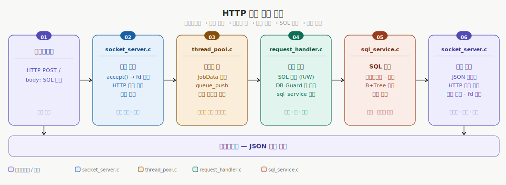
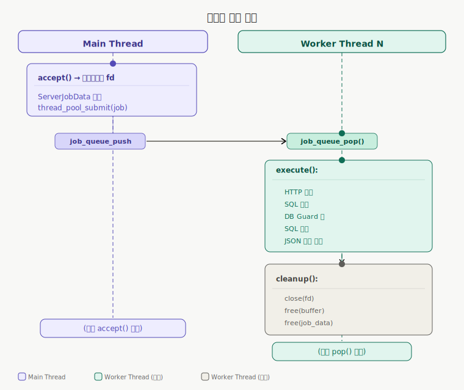

# Jungle-W8-minisql

> CLI 기반 Mini SQL 엔진에 HTTP API 서버 레이어를 추가한 C 언어 멀티스레드 프로젝트입니다.

기존 CLI SQL 실행기와 B+Tree 인덱스를 유지하면서, 외부 클라이언트가 HTTP `POST` 요청으로 `SELECT`/`INSERT`를 호출할 수 있도록 서버 계층을 추가했습니다.

---

## 목차

1. [프로젝트 개요](#1-프로젝트-개요)
2. [전체 파이프라인](#2-전체-파이프라인)
3. [동시성 이슈](#3-동시성-이슈)
4. [스레드 풀](#4-스레드-풀)
5. [엣지 케이스 검증](#5-엣지-케이스-검증)
6. [테스트](#6-테스트)
7. [실행 방법](#7-실행-방법)
8. [발표 시연 순서](#8-발표-시연-순서)

---

## 1. 프로젝트 개요

```text
클라이언트 (HTTP POST)
        ↓
  HTTP API Server       ← 이번 주차 구현 범위
        ↓
  SQL Processor         ← 기존 B+Tree 기반 SQL 엔진
        ↓
  Database File
```

- **언어**: C (POSIX pthreads)
- **핵심 기능**: 외부 클라이언트가 HTTP POST로 SQL 명령(SELECT/INSERT)을 전송하면 JSON으로 응답
- **동시성 모델**: 스레드 풀 + 원자적 Reader-Writer 락

### 구성

- `sql_processor`: 기존 CLI 실행기
- `sql_api_server`: HTTP API 서버 런타임
- `src/server/api/`: 소켓 수신, 서버 lifecycle
- `src/server/pool/`: thread pool, job queue
- `src/server/request/`: HTTP 파싱, 요청 검증, SQL 서비스 연결
- `src/server/concurrency/`: DB read/write 보호 계층

---

## 2. 전체 파이프라인



### 레이어별 담당 파일

| 레이어 | 파일 | 주요 역할 |
|--------|------|-----------|
| 서버 생명주기 | `src/server/api/server_main.c` | 서버 생성·시작·종료 |
| 소켓 처리 | `src/server/api/socket_server.c` | accept 루프, HTTP 수신·송신 |
| 스레드 풀 | `src/server/pool/thread_pool.c` | 워커 스레드 관리 |
| 잡 큐 | `src/server/pool/job_queue.c` | 스레드 안전 큐 |
| 잡 데이터 | `src/server/pool/server_job_stub.c` | 잡 초기화·검증·정리 |
| 요청 처리 | `src/server/request/request_handler.c` | SQL 분류, DB Guard 연동 |
| SQL 서비스 | `src/server/request/sql_service.c` | SQL 파싱·실행·JSON 생성 |
| HTTP 프로토콜 | `src/server/request/http_protocol.c` | HTTP 요청/응답 직렬화 |
| DB 동시성 | `src/server/concurrency/db_guard.c` | 원자적 Reader-Writer 동기화 |

---

## 3. 동시성 이슈

### 3-1. 전체 동시성 구조

```text
                  ┌──────────────────────────────────┐
클라이언트 요청들  │       스레드 풀 (고정 N개 워커)     │
     ──→          │  워커1  워커2  워커3  ...  워커N    │
     ──→          │    │      │      │           │     │
     ──→          └────┼──────┼──────┼───────────┼─────┘
                       └──────┴──────┴───────────┘
                                   │
                    SQL 분류 (SELECT / INSERT)
                           │            │
                    READ 경로     WRITE 경로
                           │            │
                    ┌──────▼────────────▼──────┐
                    │       DB Guard           │
                    │  (원자적 Reader-Writer)   │
                    │  ┌────────────────────┐  │
                    │  │ 다수 독자 동시 허용 │  │
                    │  │ 작성자는 단독 점유 │  │
                    │  └────────────────────┘  │
                    └──────────────────────────┘
                                   │
                             B+Tree DB 파일
```

### 3-2. DB Guard — 원자적 Reader-Writer 락

**파일**: `src/server/concurrency/db_guard.c`

```c
struct DbGuard {
    atomic_int reader_count;
    atomic_int writer_active;
    atomic_int writers_waiting;
};
```

읽기 락 획득 흐름:

```text
1. writer 활성/대기 여부 확인
2. 가능하면 reader_count 증가
3. 읽기 수행
4. reader_count 감소
```

쓰기 락 획득 흐름:

```text
1. writers_waiting 증가
2. writer_active 획득 시도
3. reader_count가 0이면 쓰기 진입
4. 쓰기 수행
5. writer_active 해제
```

### 3-3. 잡 큐 — mutex + 조건 변수

**파일**: `src/server/pool/job_queue.c`

```c
struct JobQueue {
    Job *jobs;
    int capacity;
    int count;
    int head;
    int tail;
    int closed;
    pthread_mutex_t mutex;
    pthread_cond_t not_empty;
    pthread_cond_t not_full;
};
```

Push 흐름:

```text
1. Queue Lock(mutex) 획득
2. Queue가 가득 찬 상태 && 열려 있는 상태 -> not_full에서 sleep
3. Queue에 pop 발생으로 not_full signal 발생
4. mutex 재 획득하여 조건 확인 이후 접근(Queue 가 닫혀있으면 실패 반환)
5. Queue의 Tail에 Job 저장
6. Count 증가
7. not_empty signal로 대기 중인 worker wake
8. Queue Lock(mutex) 해제 후 성공 반환
```

Pop 흐름:

```text
1. Queue Lock(mutex) 획득
2. Queue가 비어 있는 상태 && 열려 있는 상태 -> not_empty에서 sleep
3. Queue에 push가 발생하면 not_empty signal 수신
4. mutex 재획득 후 조건 재확인 (Queue가 비어 있고 닫혀 있으면 0 반환)
5. Queue의 Head 위치에서 Job 추출
6. Head를 다음 칸으로 이동하고 Count 감소
7. not_full signal로 대기 중인 submitter wake
8. Queue Lock(mutex) 해제 후 Job 반환
```

허위 각성은 `if`가 아니라 `while`로 조건을 재검사해서 처리합니다.

```c
while (queue->count == 0 && !queue->closed) {
    pthread_cond_wait(&queue->not_empty, &queue->mutex);
}
```

---

## 4. 스레드 풀

### 4-1. 전체 구조

**파일**: `src/server/pool/thread_pool.c`

```c
struct ThreadPool {
    int worker_count;
    int started;
    JobQueue *queue;
    pthread_t *workers;
};
```

### 4-2. 생명주기

```text
thread_pool_create(worker_count, queue_capacity)
         │
         ├─ ThreadPool 구조체 할당
         ├─ pthread_t 배열 할당
         ├─ JobQueue 생성 (mutex + cond 초기화)
         └─ 반환 (아직 스레드 없음)
                  │
thread_pool_start(pool)
         │
         ├─ pool->started = 1
         └─ worker_count개의 pthread 생성
            각 스레드: thread_pool_worker_main(pool)
                  │
         [서버 동작 중]
                  │
thread_pool_stop(pool)
         │
         ├─ job_queue_close() → 큐 닫기
         │    └→ 대기 중 모든 워커에 broadcast
         └─ pthread_join() × worker_count → 모든 완료 대기
                  │
thread_pool_destroy(pool)
         │
         ├─ thread_pool_stop() 호출
         ├─ job_queue_destroy() → 잔여 잡 정리
         └─ workers 배열 해제
```

### 4-3. 워커 스레드 루프

```c
static void *thread_pool_worker_main(void *arg) {
    ThreadPool *pool = arg;
    Job job = {0};

    while (job_queue_pop(pool->queue, &job)) {
        run_job(&job);
        memset(&job, 0, sizeof(job));
    }

    return NULL;
}
```

```c
static void run_job(Job *job) {
    job->execute(job->data);
    if (job->cleanup != NULL) {
        job->cleanup(job->data);
    }
}
```

### 4-4. 잡 소유권 계약

```text
제출 성공 시:
  Main Thread ──(소유권 이전)──→ Worker Thread
  → worker가 execute() + cleanup() 호출

제출 실패 시:
  thread_pool_submit() 내부에서 cleanup() 직접 호출
  → 이중 해제 방지
```

`ServerJobData` cleanup은 `src/server/pool/server_job_stub.c`의 `server_job_cleanup()`이 담당합니다.

```c
void server_job_cleanup(void *job_data) {
    ServerJobData *server_job_data = job_data;

    server_job_data_destroy(server_job_data);
    free(server_job_data);
}
```

### 4-5. 예외 처리: 부분 스레드 생성 실패

```c
for (index = 0; index < pool->worker_count; index++) {
    if (pthread_create(&pool->workers[index], NULL, thread_pool_worker_main, pool) != 0) {
        sql_set_error(error, 0, 0, "failed to start worker thread");
        pool->worker_count = index;
        thread_pool_stop(pool);
        return 0;
    }
}
```

### 4-6. 스레드 처리 흐름



---

## 5. 엣지 케이스 검증

### 5-1. HTTP 입력 경계

**파일**: `src/server/api/socket_server.c`

| 엣지 케이스 | 처리 방법 | 반환값 |
|------------|----------|--------|
| 빈 요청 (0바이트) | 즉시 감지 | `READ_EMPTY` |
| 헤더 미완성 (`\r\n\r\n` 없음) | 버퍼 동적 확장 후 재수신 | 계속 수신 |
| 요청 크기 > 64KB | 수신 중단 | `READ_TOO_LARGE` |
| Content-Length 파싱 오류 | 검증 실패 처리 | `READ_ERROR` |
| 소켓 타임아웃 | `setsockopt()` SO_RCVTIMEO 설정 | `READ_ERROR` |

### 5-2. API 요청 검증

**파일**: `src/server/request/request_handler.c`

| 검증 항목 | 조건 | HTTP 에러 코드 |
|----------|------|---------------|
| HTTP 메서드 | POST 이외의 메서드 | `405 Method Not Allowed` |
| 요청 경로 | `/` 로 시작하지 않음 | `400 Bad Request` |
| 요청 바디 | 비어있거나 공백만 존재 | `400 Bad Request` |
| SQL 분류 | SELECT/INSERT 외 알 수 없는 구문 | `400 Bad Request` |

### 5-3. SQL 파싱·실행 검증

**파일**: `src/server/request/sql_service.c`

```text
SQL 처리 검증 단계
─────────────────
공백/주석 제거 후 빈 문자열 → 에러
          ↓
키워드 매칭 (대소문자 무관) → UNKNOWN 거부
          ↓
컬럼 존재 여부 확인 (WHERE 절)
          ↓
정수 타입 필드 형식 검사 (is_integer_string)
          ↓
실행 성공 → JSON 직렬화
```

| 검증 항목 | 처리 위치 | 설명 |
|----------|----------|------|
| 빈 SQL | `sql_service.c` | 공백·주석 제거 후 재검사 |
| 알 수 없는 키워드 | `sql_service.c` | 대소문자 무관 prefix 매칭 |
| 존재하지 않는 컬럼 | `sql_service.c` | `find_column_index()` 반환값 검사 |
| 정수 필드 형식 오류 | `sql_service.c` | `is_integer_string()` 검증 |
| 타입 불일치 | `sql_service.c` | 저장 타입과 입력 타입 비교 |

### 5-4. JSON 직렬화 안전성

**파일**: `src/server/request/sql_service.c`

| 항목 | 설명 |
|------|------|
| 특수문자 이스케이프 | `sql_json_quote()` 로 `\`, `"`, `\n`, `\r`, `\t` 등 처리 |
| `size_t` 오버플로 감지 | 버퍼 확장 전 크기 역전 여부 확인 |
| 동적 버퍼 확장 | 초기 128바이트, 용량 부족 시 2배씩 증가 |

---

## 6. 테스트

```sh
make unit
make integration
make api-smoke
make test
```

- `unit`: parser, B+Tree, server config, HTTP protocol, SQL service, request handler 검증
- `integration`: 기존 CLI 기반 SQL roundtrip 검증
- `api-smoke`: API 서버를 띄운 뒤 `POST /query` smoke와 동시 SELECT/INSERT 병렬 처리 검증

---

## 7. 실행 방법

### CLI 실행

```sh
./sql_processor --query "SELECT * FROM users WHERE id = 2;" --db ./data
./sql_processor --sql tests/integration/smoke.sql --db ./data
./sql_processor --bench 1000000 --db ./data
```

### API 서버 실행

```sh
./sql_api_server --host 0.0.0.0 --port 8080 --db ./data
```

요청 형식은 `POST` + request body 입니다.

```sh
curl -X POST http://127.0.0.1:8080/query \
  -H "Content-Type: text/plain" \
  --data "SELECT * FROM users WHERE id = 2;"
```

예상 응답 본문:

```json
{"ok":true,"type":"select","table":"users","rows":[{"id":2,"name":"Bob","age":22}]}
```

---

## 8. 발표 시연 순서

1. `sql_processor`로 기존 SQL 엔진 동작 시연
2. `sql_api_server` 실행
3. `curl` 또는 Postman으로 `POST /query` 요청 전송
4. `SELECT` 응답 확인
5. 필요하면 `INSERT` 후 재조회로 API-DB 연결 시연
